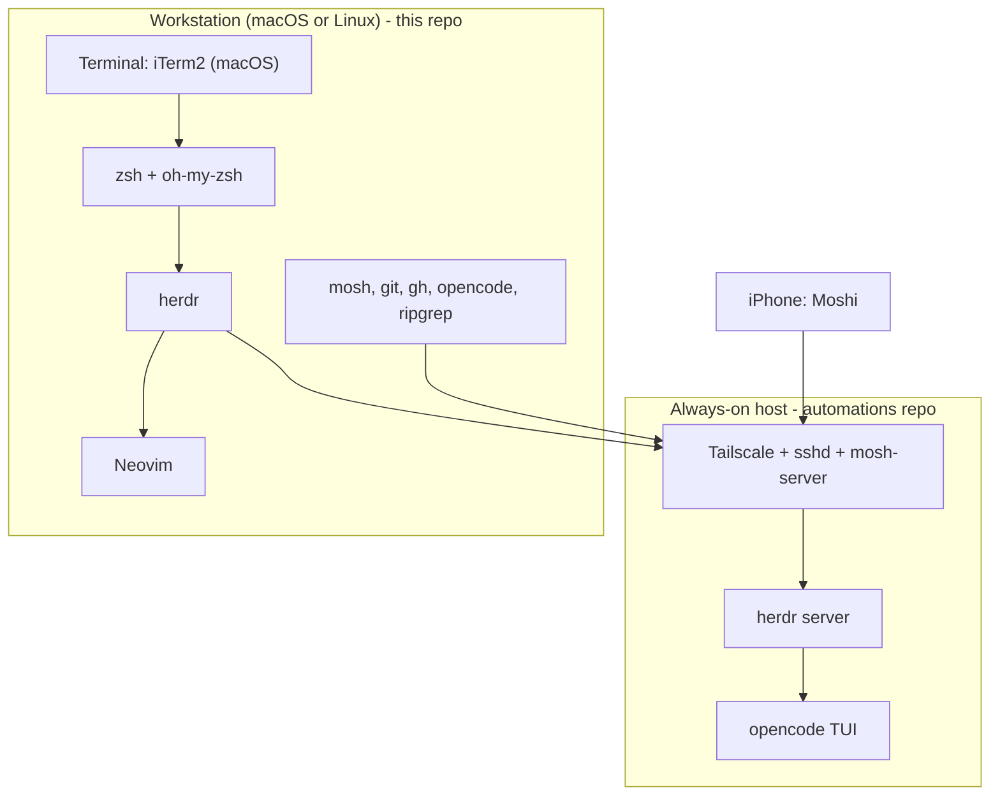

# Architecture

TUI IDE is a cross-platform development environment. One repo configures the
interactive surface on macOS and Linux and the clients that reach an always-on
host.

## Goals

- One command bootstraps a new machine.
- The same shell, multiplexer, and editor on macOS and Linux.
- Dotfiles are portable, with machine-specific values kept out of git.
- A clean path to an always-on host without coupling the client repo to it.

## Non-Goals

- Provisioning the always-on host. That lives in `automations`.
- Knowledge management. That lives in `second-brain`.

## System View

## Components

| Component | Role | Notes |
|-----------|------|-------|
| iTerm2 | macOS terminal | Clickable custom URL schemes (obsidian://, onepassword://); prefs tracked as a plist snapshot |
| Moshi | iOS terminal | Mosh-native, herdr-integrated; Blink is the fallback |
| zsh + oh-my-zsh | Shell | Portable across macOS and Linux |
| herdr | Multiplexer | Server-side sessions; narrow-screen TUI for mobile |
| Neovim | Editor | Human editing surface; agent lives in the opencode TUI |
| mosh | Transport | Interactive sessions over the tailnet; OpenSSH for files |
| Homebrew | Package manager | Same toolchain on macOS and Linuxbrew |
| GNU Stow | Dotfile manager | `dotfiles/<pkg>` symlinked into `$HOME` |

## Cross-Machine Model

- **Toolchain:** one `Brewfile` for macOS and Linuxbrew; casks isolated in
  `Brewfile.macos`; apt fallback for Linux without Homebrew.
- **Dotfiles:** Stow packages map directly onto `$HOME`. Adding a package means
  adding a directory under `dotfiles/` and listing it in `install.sh`.
- **Overlays:** machine-specific values live in `*.local` files that are
  git-ignored. `dotfiles/git/.gitconfig` includes `~/.gitconfig.local`, which
  holds identity and the 1Password SSH signing agent path.
- **Secrets:** the 1Password CLI (`op`) provides credentials. No secret is ever
  committed.
- **iTerm2 (macOS):** a snapshot of `com.googlecode.iterm2.plist` lives in
  `iterm2/`. iTerm2 loads preferences from `~/.config/iterm2/AppSupport`, which
  `install.sh` seeds from the snapshot when absent. GUI changes are copied back
  into the repo to sync.

## Install Flow

1. `install.sh` detects the OS.
2. `brew bundle` installs the toolchain (casks on macOS only).
3. Conflicting files are backed up to `~/.dotfiles-backup/<timestamp>/`.
4. `stow` links the dotfiles into `$HOME`.
5. Manual steps finish the GUI and account setup (iTerm2, Tailscale, `op`).

## Relationship to Other Repos

- `automations`: owns the GCP always-on host and its runtime. It can consume
  this repo's dotfiles later so the host and workstation share one config.
- `second-brain`: knowledge store and the source of the research behind these
  decisions.

## Decisions

Current accepted ADRs. Superseded records are omitted.

| ID | Title | Status |
|----|-------|--------|
| [0001](adr/0001-separate-tui-ide-repo.md) | Keep a separate `tui-ide` repo | Accepted |
| [0002](adr/0002-homebrew-bundle-and-gnu-stow.md) | Homebrew Bundle plus GNU Stow for provisioning | Accepted |
| [0003](adr/0003-terminal-clients-iterm2-and-moshi.md) | iTerm2 on macOS and Moshi on iOS | Accepted |
| [0004](adr/0004-herdr-as-multiplexer.md) | herdr as the multiplexer | Accepted |
| [0005](adr/0005-neovim-as-editor.md) | Neovim as the editor | Accepted |
| [0006](adr/0006-mosh-over-tailscale.md) | mosh over Tailscale, OpenSSH for files | Accepted |
| [0007](adr/0007-agent-surface-in-herdr-pane.md) | Agent surface is the opencode TUI in a herdr pane | Accepted |
| [0008](adr/0008-local-overlay-for-sensitive-values.md) | Overlay files for machine-specific values | Accepted |
| [0009](adr/0009-track-iterm2-preferences.md) | Track iTerm2 preferences from a synced plist | Accepted |
