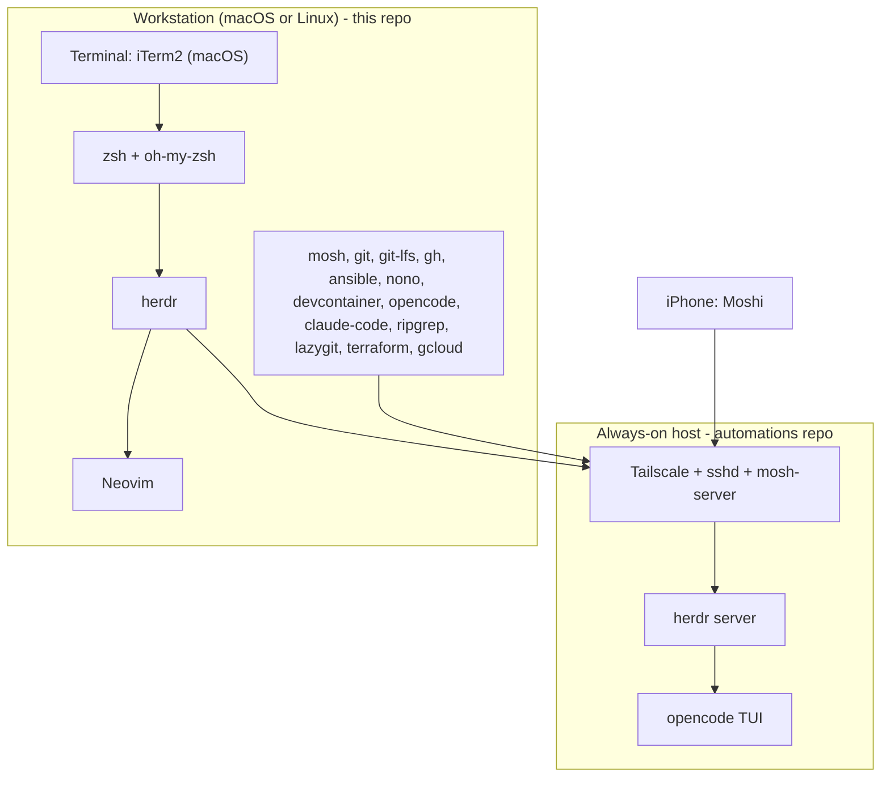

# Architecture

TUI IDE is a cross-platform development environment. One repo configures the
interactive surface on macOS and Linux and the clients that reach an always-on
host.

## Goals

- One command bootstraps a new machine.
- The same shell, multiplexer, and editor on macOS and Linux.
- Dotfiles are portable, with machine-specific values kept out of git.
- A clean path to an always-on host without coupling the client repo to it.

## Non-Goals

- Provisioning the always-on host. That lives in `automations`.
- Knowledge management. That lives in `second-brain`.

## System View

```mermaid
flowchart TB
    subgraph Workstation["Workstation (macOS or Linux) - this repo"]
        Term["Terminal: iTerm2 (macOS)"]
        Shell["zsh + oh-my-zsh"]
        Mux["herdr"]
        Edit["Neovim"]
        Tools["mosh, git, git-lfs, gh, ansible, nono, devcontainer, opencode, claude-code, ripgrep, lazygit, terraform, gcloud"]
    end

    subgraph Remote["Always-on host - automations repo"]
        TSNet["Tailscale + sshd + mosh-server"]
        Hmux["herdr server"]
        Agent["opencode TUI"]
    end

    IOS["iPhone: Moshi"]

    Term --> Shell --> Mux
    Mux --> Edit
    Mux --> TSNet
    Tools --> TSNet
    IOS --> TSNet
    TSNet --> Hmux
    Hmux --> Agent
```

## Components

| Component | Role | Notes |
|-----------|------|-------|
| iTerm2 | macOS terminal | Clickable custom URL schemes (obsidian://, onepassword://); prefs tracked in-repo |
| Moshi | iOS terminal | Mosh-native, herdr-integrated; Blink is the fallback |
| zsh + oh-my-zsh | Shell | Portable across macOS and Linux |
| herdr | Multiplexer | Server-side sessions; UI theme follows the terminal palette |
| Neovim | Editor | Human editing surface; agent lives in the opencode TUI. `$EDITOR`, and `vi` by alias |
| nono | Agent sandbox | Kernel-enforced default-deny allow-list (Landlock on Linux, Seatbelt on macOS). Wraps `opencode` and `claude`; `-yolo` variants opt out |
| devcontainer | Dev Containers CLI | Installed for projects that want their build in a container. No repo wiring yet; how it relates to the nono sandbox is undecided |
| Claude Code | Agent CLI | Alternate agent surface; user settings merged from a tracked template, hooks left local |
| opencode | Agent CLI | Primary agent surface, pinned to the 1.x line from `anomalyco/tap`; the corporate LLM gateway does not serve v2 ([ADR-0025](adr/0025-pin-opencode-to-the-1.x-line.md)) |
| mosh | Transport | Interactive sessions over the tailnet; OpenSSH for files |
| Homebrew | Package manager | Same toolchain on macOS and Linuxbrew |
| GNU Stow | Dotfile manager | `dotfiles/<pkg>` symlinked into `$HOME` |
| LazyGit | Git client | TUI launched from Neovim with `<leader>gg` |
| Terraform, Ansible, gcloud | Cloud & IaC | Provisioning and config management against GCP |
| render-markdown.nvim | Markdown renderer | In-buffer Obsidian-style rendering, `obsidian` preset |
| obsidian.nvim | Vault manager | Wikilinks, quick switch, new notes; UI disabled. Optional: loaded only when the local overlay names a workspace that exists on disk |
| mini.map | Minimap | Floating buffer overview on the right, `<leader>vm`; search and diagnostic highlights |

## Cross-Machine Model

- **Toolchain:** one `Brewfile` for macOS and Linuxbrew; casks isolated in
  `Brewfile.macos`; apt fallback for Linux without Homebrew. Tools the
  distribution does not package install from upstream instead: herdr from
  `herdr.dev`, LazyGit from its GitHub release tarball into `$HOME/.local/bin`,
  nono from its release `.deb`. Each is skipped when the binary is already
  present.
- **Dotfiles:** Stow packages map directly onto `$HOME`. Adding a package means
  adding a directory under `dotfiles/` and listing it in `install.sh`. Stow
  runs with `--no-folding` so apps that rewrite their config in place never
  write into the repo tree. The backup step resolves each target with
  `realpath` and skips anything inside the repo, so a leftover directory fold
  can never make `install.sh` move a tracked file out of the tree.
- **Overlays:** machine-specific values live in `*.local` files that are
  git-ignored. `dotfiles/git/.gitconfig` includes `~/.gitconfig.local`, which
  holds identity and the 1Password SSH signing agent path.
- **Secrets:** the 1Password CLI (`op`) provides credentials. No secret is ever
  committed. The agent CLIs additionally run with those credentials out of
  reach: nono denies `~/.ssh`, `~/.aws`, `~/.config/gcloud`, `~/.config/gh`,
  and the shell configs inside the sandbox. The one exception is the
  `claude-code` pack, which grants `~/Library/Keychains` read+write because
  Claude Code keeps its OAuth token in the login keychain.
- **Agent sandbox:** `opencode` and `claude` are zsh functions that run the real
  binaries under `nono run` with the profiles from the `nolabs-ai/opencode` and
  `nolabs-ai/claude` registry packs, which `install.sh` pulls. Capability sets
  are upstream and signature-verified, not tracked here. `opencode` additionally
  layers the tracked `tui-ide-agent` profile from `dotfiles/nono`, which extends
  the pack with the directories this repo's agent sessions actually used
  (`~/.config/{nvim,herdr,iterm2}`, plus `~/Library/{Fonts,LaunchAgents}` on
  macOS); machine-specific paths such as the sibling `second-brain` repo go in a
  git-ignored `tui-ide-agent-local.json` overlay, and the wrapper prefers the
  overlay when it exists. `opencode-yolo` and `claude-yolo` are the same
  binaries with no boundary. Because `nono run` supervises rather than execs,
  the wrapper also sets `HERDR_AGENT` on the `nono` command so herdr can still
  identify the agent behind the wrapper. Claude Code's own sandbox is off in the
  tracked settings template, so nono is the only layer and the
  `dangerouslyDisableSandbox` retry path is closed. See
  [ADR-0020](adr/0020-sandbox-agent-clis-with-nono.md),
  [ADR-0021](adr/0021-derive-nono-profile-from-observed-use.md), and
  [ADR-0022](adr/0022-label-sandboxed-agent-for-herdr.md).
- **iTerm2 (macOS):** `com.googlecode.iterm2.plist` lives in the repo at
  `dotfiles/iterm2/.config/iterm2/AppSupport/`. `install.sh` enables iTerm2's
  custom preferences folder with `defaults write` when iTerm2 is quit, so GUI
  changes land in the working tree. It is not stowed.
- **Colors:** the iTerm2 preset ("Warm Burnout Dark") is the source of truth;
  herdr sets `theme.name = "terminal"` and opencode renders from the terminal
  palette too, `theme = "system"` in `tui.jsonc` on the pinned 1.x line
  ([ADR-0025](adr/0025-pin-opencode-to-the-1.x-line.md)). opencode's file is
  machine-local, so `install.sh` seeds the one the installed version reads from
  a tracked example rather than stowing it
  ([ADR-0026](adr/0026-seed-the-client-config-the-installed-version-reads.md)).

## Install Flow

1. `install.sh` detects the OS.
2. `brew bundle` installs the toolchain (casks on macOS only) and
   `brew pin anomalyco/tap/opencode` holds opencode on the 1.x line
   ([ADR-0025](adr/0025-pin-opencode-to-the-1.x-line.md)).
3. `nono pull` fetches the agent sandbox profiles, so the first launch does not
   prompt for a pack install.
4. Conflicting files are backed up to `~/.dotfiles-backup/<timestamp>/`. Targets
   that resolve into the repo are skipped.
5. `stow --no-folding` links the dotfiles into `$HOME`.
6. Two files that cannot be linked are reconciled instead: `~/.claude/settings.json`
   is deep-merged from a tracked template
   ([ADR-0019](adr/0019-merge-claude-user-settings.md)), and the opencode client
   config (`tui.jsonc` on 1.x, `cli.json` on 2.x) is copied from the matching
   tracked example when it is missing
   ([ADR-0026](adr/0026-seed-the-client-config-the-installed-version-reads.md)).
   Neither overwrites a file that already exists.
7. Manual steps install iTerm2 and finish the account setup (Tailscale, `op`).

## Relationship to Other Repos

- `automations`: owns the GCP always-on host and its runtime. It can consume
  this repo's dotfiles later so the host and workstation share one config.
- `second-brain`: knowledge store and the source of the research behind these
  decisions.

## Decisions

Every ADR with its current status. Superseded records are kept and name the
record that replaced them.

| ID | Title | Status |
|----|-------|--------|
| [0001](adr/0001-separate-tui-ide-repo.md) | Keep a separate `tui-ide` repo | Accepted |
| [0002](adr/0002-homebrew-bundle-and-gnu-stow.md) | Homebrew Bundle plus GNU Stow for provisioning | Accepted |
| [0003](adr/0003-terminal-clients-iterm2-and-moshi.md) | iTerm2 on macOS and Moshi on iOS | Accepted |
| [0004](adr/0004-herdr-as-multiplexer.md) | herdr as the multiplexer | Accepted |
| [0005](adr/0005-neovim-as-editor.md) | Neovim as the editor | Superseded by [0018](adr/0018-neovim-as-editor-variable.md) |
| [0006](adr/0006-mosh-over-tailscale.md) | mosh over Tailscale, OpenSSH for files | Accepted |
| [0007](adr/0007-agent-surface-in-herdr-pane.md) | Agent surface is the opencode TUI in a herdr pane | Accepted |
| [0008](adr/0008-local-overlay-for-sensitive-values.md) | Overlay files for machine-specific values | Accepted |
| [0009](adr/0009-track-iterm2-preferences.md) | Track iTerm2 preferences from a synced plist | Superseded by [0010](adr/0010-manage-iterm2-plist-in-repo.md) |
| [0010](adr/0010-manage-iterm2-plist-in-repo.md) | Manage the iTerm2 plist in the repo directory | Accepted |
| [0011](adr/0011-lazygit-as-git-client.md) | LazyGit as the git client | Superseded by [0017](adr/0017-lazygit-from-brewfile-or-github-releases.md) |
| [0012](adr/0012-obsidian-compatible-markdown-editing.md) | Obsidian-compatible Markdown editing | Accepted |
| [0013](adr/0013-apply-color-scheme-on-fresh-machine.md) | Apply the tracked color scheme on a fresh machine | Accepted |
| [0014](adr/0014-stow-dotfiles-without-folding.md) | Stow dotfiles without folding | Accepted |
| [0015](adr/0015-run-herdr-server-under-launchd-on-macos.md) | Run the herdr server under launchd on macOS | Accepted |
| [0016](adr/0016-never-back-up-files-that-resolve-into-the-repo.md) | Never back up files that resolve into the repo | Accepted |
| [0017](adr/0017-lazygit-from-brewfile-or-github-releases.md) | LazyGit as the git client, from Brewfile or GitHub releases | Accepted |
| [0018](adr/0018-neovim-as-editor-variable.md) | Neovim as `$EDITOR`, with `vi` aliased to nvim | Accepted |
| [0019](adr/0019-merge-claude-user-settings.md) | Merge Claude Code user settings instead of stowing them | Accepted |
| [0020](adr/0020-sandbox-agent-clis-with-nono.md) | Sandbox the agent CLIs with nono | Accepted |
| [0021](adr/0021-derive-nono-profile-from-observed-use.md) | Derive the nono profile from observed session use | Accepted |
| [0022](adr/0022-label-sandboxed-agent-for-herdr.md) | Label the sandboxed agent for herdr with `HERDR_AGENT` | Accepted |
| [0023](adr/0023-seed-the-opencode-tui-config.md) | Seed the opencode TUI config from a tracked example | Superseded by [0024](adr/0024-seed-the-opencode-client-config.md) |
| [0024](adr/0024-seed-the-opencode-client-config.md) | Seed the opencode client config from a tracked example | Superseded by [0026](adr/0026-seed-the-client-config-the-installed-version-reads.md) |
| [0025](adr/0025-pin-opencode-to-the-1.x-line.md) | Pin opencode to the 1.x line | Accepted |
| [0026](adr/0026-seed-the-client-config-the-installed-version-reads.md) | Seed the client config the installed version reads | Accepted |
